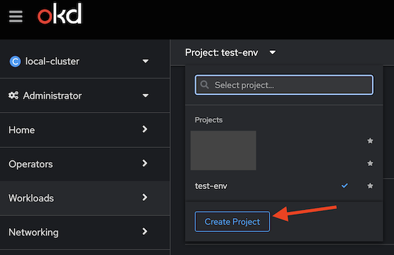

### Required environments

- Helm (https://helm.sh/docs/intro/install/)
- OC (Openshift Client)(4.14 or later https://docs.openshift.com/container-platform/4.16/cli_reference/openshift_cli/getting-started-cli.html)

### OC login

```shell
oc login --token=<token> --server=<cluster-host>
```

### To show deployments

To view templates generated by Helm with the Bitbucket profile:

```shell
helm template chart --set bitbucket.license=<license> --set vcsFacade.image.version=<version>
```

To install the application in the <project> namespace:

```shell
helm upgrade --wait --install <helm_release> chart --namespace <project> --set bitbucket.license=<license> --set vcs-facade.image.tag=<version> --set clusterDomain=<cluster_domain> --set localDomain=<local_host> --set dockerRegistry=<dockerRegistry> --set platform=okd
```

To uninstall the application:

```shell 
helm uninstall <helm_release> --namespace <project>
```

#### Parameters

- helm_release      - Helm release name(This release is a specific deployment of that chart with a unique configuration, and it includes all the Kubernetes resources specified in the chart templates, such as deployments, services, and config maps. Helm releases allow you to manage, upgrade, and roll back your applications easily)
- project           - Project namespace
- bitbucket.license - license token for BitBucket server
- dockerRegistry    - Docker registry with images.
- cluster_domain    - Cluster domain(the root domain used for all internal addresses within the cluster. It ensures predictable DNS names for inter-service communication.)
- local_host        - Local host(typically refers to the default local domain suffix used for internal network addresses)

### To run from gradle

In the ft and test modes, a different set of environment services is launched. Therefore, the deployment task is divided into two: deployHelmTest and deployHelmFt.

```shell
./gradlew deployHelmTest -Pdocker.registry=<docker_registry> -Pplatform=<okd | docker> -PhelmRelease=<release_name> -PhelmNamespace=<project> -PlocalDomain=<local_domain> -PclusterDomain=<cluster_domain> -Ptest.profile=<bitbucket | gitea> -Pversion=<version> -Pbitbucket.license=<license>
```
or
```shell
./gradlew deployHelmFt -Pdocker.registry=<docker_registry> -Pplatform=<okd | docker> -PhelmRelease=<release_name> -PhelmNamespace=<project> -PlocalDomain=<local_domain> -PclusterDomain=<cluster_domain> -Ptest.profile=<bitbucket | gitea> -Pversion=<version> -Pbitbucket.license=<license>
```


```shell
./gradlew uninstallHelm -PhelmRelease=<release_name> -PhelmNamespace=<project>
```

#### To run ft

```shell
./gradlew ft -Pdocker.registry=<docker_registry> -Pplatform=<okd | docker> -PhelmRelease=<release_name> -PhelmNamespace=<project> -PlocalDomain=<local_domain> -PclusterDomain=<cluster_domain> -Ptest.profile=<bitbucket | gitea> -Pversion=<version> -Pbitbucket.license=<license>
```

#### To unit tests
```shell
./gradlew test -Pdocker.registry=<docker_registry> -Pplatform=<okd | docker> -PhelmRelease=<release_name> -PhelmNamespace=<project> -PlocalDomain=<local_domain> -PclusterDomain=<cluster_domain> -Ptest.profile=<bitbucket | gitea> -Pversion=<version> -Pbitbucket.license=<license>
```


If you use **local.properties**, the command call is reduced to:

```shell   
./gradlew deployHelmTest
```
```shell   
./gradlew test ft
```


### Create a project in OKD

1. To create a new project, you need to click the **Create Project** button in the dropdown menu, as shown in the image below.



2. Next, you need to create a **ServiceAccount** for access to the project. To do this, click the **Create ServiceAccount** button as shown in the image below.


3. In the ServiceAccount parameters, you need to specify a unique arbitrary name and the project name, as shown below.

```yaml
apiVersion: v1
kind: ServiceAccount
metadata:
  name: <service_account_name>
  namespace: <project_name>
```

4. The created ServiceAccount will automatically create two sections in the Secrets section. One of them should have the type service-account-token, as shown in the picture. By entering this section, you will find a permanent token in the token field, which can be used to access OKD.


5. To assign roles, in the Project Access section, you need to add new access. In the Name field, specify the name of the ServiceAccount, and in the Role field, specify the role that will be assigned to this ServiceAccount.


#### Debugging

Get pod name:

```shell
oc get pods -n <project>
```

Then, forward the port:

```shell
oc port-forward <pod-name> 5005:5005
```
